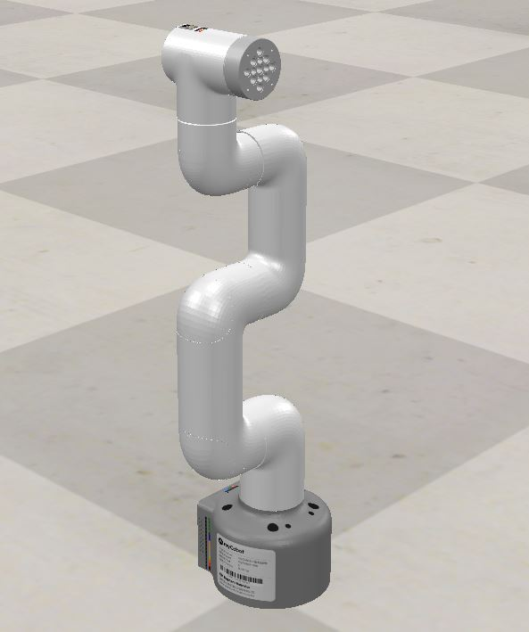
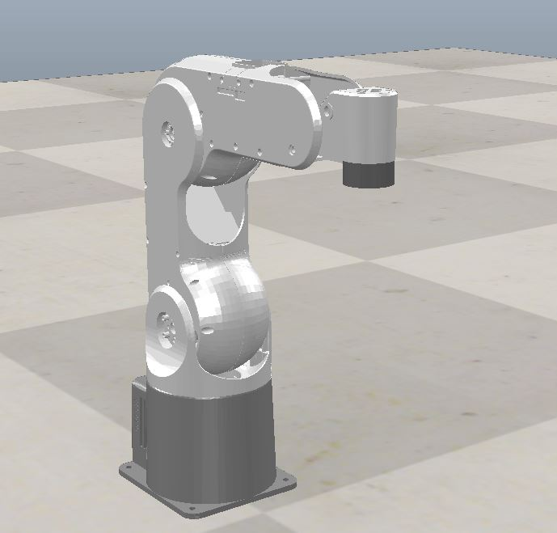
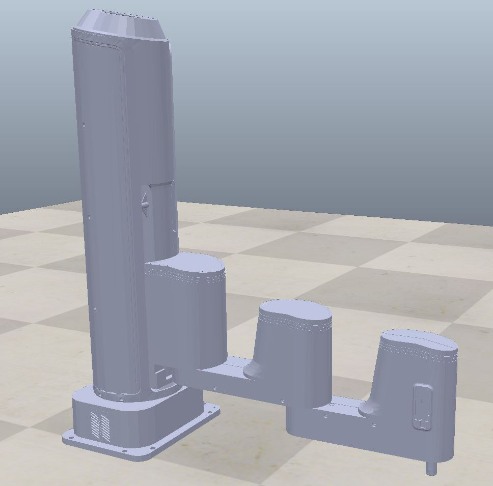

## Load robot URDF file to CoppeliaSim scene

>Related files: load_urdf_class.ts

**Notes:** Not all robot URDF can be successfully imported to CoppeliaSim, it requires complete path or proper package path to mesh, just like the folder structure in URDF example 

1. Enter the folder **Load_URDF_robot**
2. Run the following command, this is a simple demo to generate instance of class **robURDF**
3. In the folder **URDF example**, it has some robot URDF file, which can be correctly imported into CoppeliaSim

```bash
cd Load_URDF_robot
ts-node load_urdf_class.ts
```

4. After successfully imported URDF to CoppeliaSim, the robot model will be automatically saved in the folder **CoppeliaSim scene/default robot models**

**You can also add your own robotic arm models and URDF file......**

## Some robot models

1. mycobot280


2. mypal


1. M1 Pro
