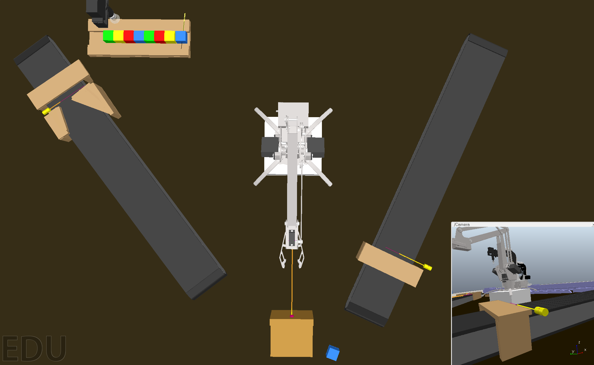

# The Master's thesis
Author: Zucheng Han

Here you can check out the related code and result.

>Prerequest: node.js, CoppeliaSim V4.4.0 installed

## Introduction

## Content

- [CoppeliaSim scens communication via Remote API](./Virtual_scenes/)
- [Virtual device things description](./virtual_things_description/)
- [Virtual IoT lab](./virtual_devices_WoT/)
- [Automatic generate robot things description](./Generate_robot_description/)

## Reference

