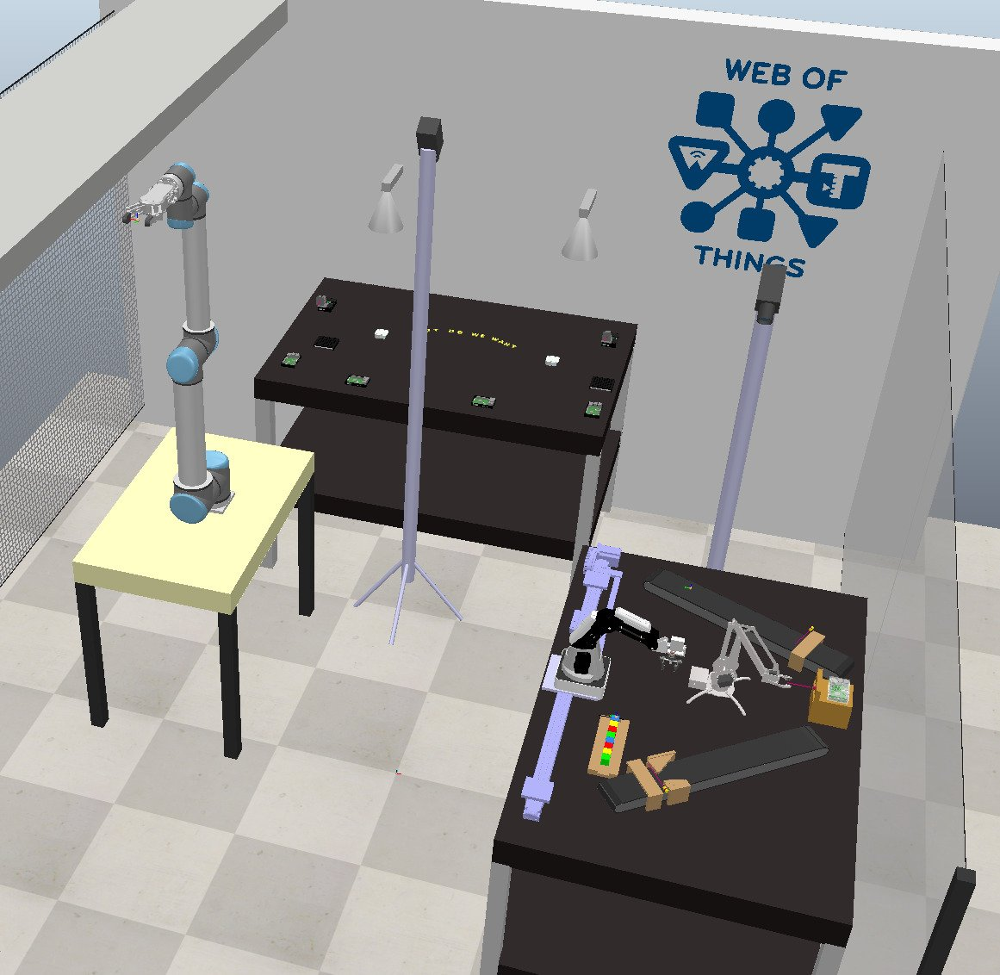

# RobWoT

## Introduction

RobWoT offers a set of methods to automatically generate Web of Things-compliant Digital Twins and Simulations using only a robot's Universal Robot Description Format (URDF) as an input.
Furthermore, RobWoT provides methods for automatically generating and annotating the robot's Thing Description (TD) with its workspace based on the simulated environment.

RobWoT methods have been implemented in CoppeliaSim using its Remote API which runs over Websockets.

To showcase our methods, we recreate setups of the IoT Remote Lab (see picture below) of the Professorship of Embedded Systems and Internet of Things located in the main campus of the Technical University of Munich (TUM) and provide all the code that allows interacting using WoT interaction affordances with the devices inside these setups.

## Installation

- Prerequisite: Node.js, CoppeliaSim V4.4.0 or higher installed
- Run the `npm install` or `yarn install` command to install necessary packages in the repository root directory

## Try it yourself

After installation, you can try some virtual scenes yourself.
To do so, switch to [Setups/IoT_Remote_Lab](./Setups/IoT_Remote_Lab) and follow the steps in that readme.

To try the [digital twin demos](./DigitalTwinDemos), you need credentials for interacting with real devices.
Please contact [Fady Salama](https://www.ce.cit.tum.de/en/esi/staff/salama/) to get credentials.

## Table of Contents

There are different resources available in this repository. They are listed below for convenience:

- [Thing Descriptions of Virtual Devices](./TDs/Virtual/)
- [Thing Descriptions of Real Devices](./TDs/Real/)
- [URDF Examples of Robots](./URDFs/)
- [Individual Things to be used in Simulation Setups](./SimulationThings/) (Under construction!)
- [Simulation Setups including CoppeliaSim Scenes and Simulation in the Loop](./Setups/)
- [Digital Twin Demos](./RealLifeDemos/)
- [Automatic import URDF in CoppeliaSim scene to generate robot model](./Library/Load_URDF_robot/)
- [Automatic implementation of inverse kinematics calculation for robots](./Library/Robot_WoT_Server/)
- [Automatic generation robot Thing Description](./Library/GenerateRobotDescription/)

