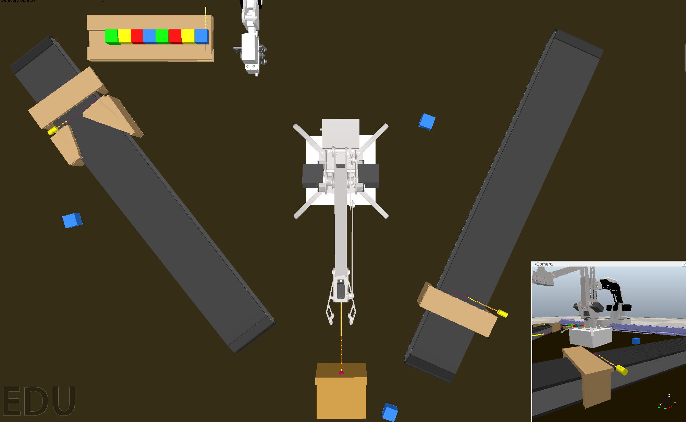

## The Coppeliasim scene to reproduce the IoT lab platform

>Virtual_IoT_lab.ttt: 90% replicate the IoT lab platform except dobot gripper


>Virtual_IoT_lab_new.ttt: 95% replicate the IoT lab plafrom


Due the characteristic of physical engine in Coppeliasim, the complex gripper lead to more complex collision calculations in the simulation. Therefore,  normally the success rate of whole process  **client_template.ts**  in scene **Virtual_IoT_lab.ttt** is 95%, and the success rate in scene **Virtual_IoT_lab_new.ttt** is 90%. It is recommended to test your client script in scene  **Virtual_IoT_lab.ttt** at beginning

Besides, object such as cube or gripper shaking is a normal phenomenon in Coppeliasim simulation. If sometimes action fails due to the vibration of the object. You can try to restart the Coppeliasim to fix this problem

## How to initialize the virtual IoT lab based on WoT server

>Related files: virtual_devices_server.ts,virtual_devices_server_new.ts, client_template.ts

>Note: the client_template.ts file is just an example WoT client, you can write your own WoT client

1. Run the ```npm install``` command to install necessary packages in the repository root directory
2. Please open the Coppeliasim and load the scene file **Virtual_IoT_lab.ttt** or **Virtual_IoT_lab_new.ttt** manually
3. Enter the **virtual_devices_WoT** folder and run the following command

```
cd virtual_devices_WoT
ts-node virtual_devices_server.ts
ts-node client_template.ts
```

or

```
cd virtual_devices_WoT
ts-node virtual_devices_server_new.ts
ts-node client_template.ts
```

or you can try to interact with WoT server via subscribe event

```
ts-node client_template_event.ts
```

4. Don't run two scene and corresponding server at the same time, which will cause port conflict.
5. It requires 5-7 seconds for the server to initialization. So it needs a little time interval between commands.
6. You can write your own client script, or you can directly use **client_template.ts** 